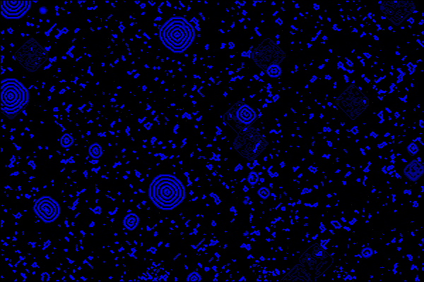
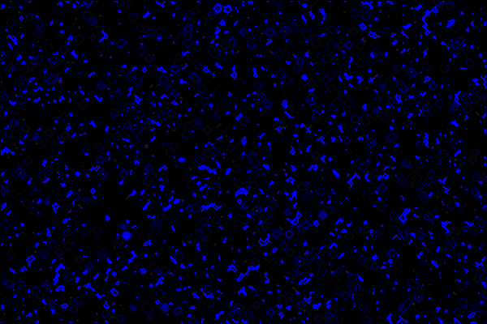
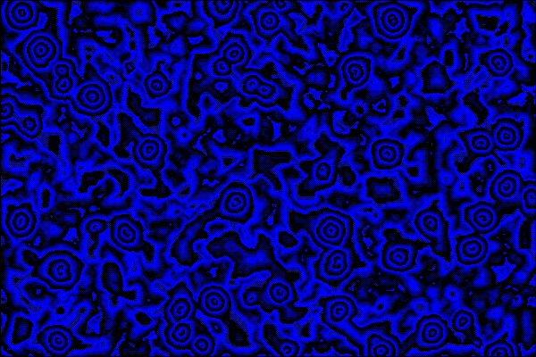
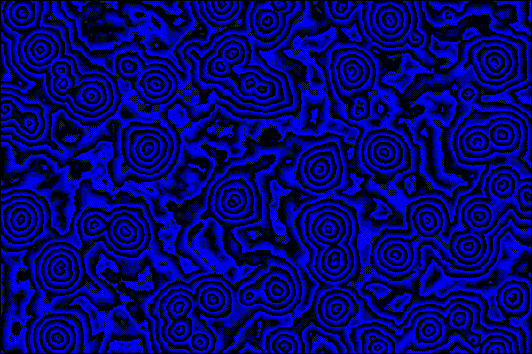
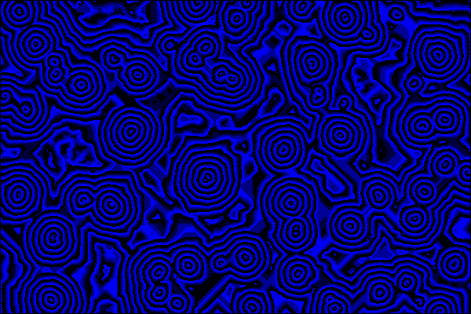
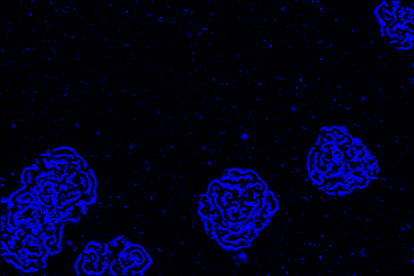

BelousovZhabotinskyScreensaver
======================

A Windows screensaver written in C# and WPF.

The screensaver is inspired by a chemical reaction called the 
Belousov-Zhabotinsky reaction. The reaction is described as a nonlinear
chemical oscillator, which sums it up fairly well.

The algorithm used in the screensaver is described in Gary William Flake's
book *The Computational Beauty of Nature*. The screensaver is based on
this description, although C code is available (see references section).

Caveats and Omissions
---------------------

* The code is fairly raw and does not support many of the things expected
  of a screensaver in Windows (preview, settings, multiple screen support
  and the like).
* Some of the constants are hard coded.
* The code for generating palettes is crude. I have a better version of this
  but it is not in the code in the repository.

Installation
------------

The source code should be built with Visual Studio 2010.
The resulting .EXE file should be renamed to .SCR and copied to the following
folder, even on 64 bit editions of Windows:

    C:\Windows\System32

References
----------

* https://ccrma.stanford.edu/CCRMA/Courses/220b/Lectures/6/Examples/cbn/code/src/hp.c
* http://en.wikipedia.org/wiki/Belousov%E2%80%93Zhabotinsky_reaction
* http://mitpress.mit.edu/books/flaoh/cbnhtml/toc.html
* http://www.youtube.com/watch?v=bH6bRt4XJcw

License
-------

MIT permissive license. See LICENSE.txt for full license details.     
     
Source Code Repository
----------------------
 
https://github.com/thomasbratt/BelousovZhabotinskyScreensaver

